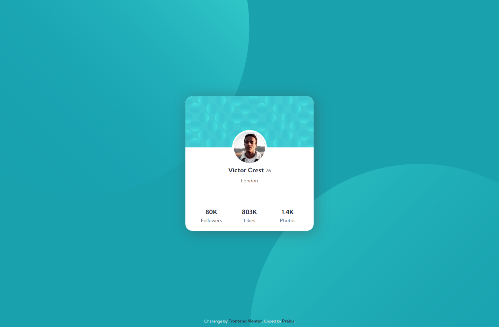

# FEM - Profile Card Component

### links

[Challenge From FrontendMentor](https://www.frontendmentor.io/challenges/profile-card-component-cfArpWshJ)\
[Live Site here](https://mgksp.github.io/profile_card_component/)

### Built with

- html
- css

### Screenshots

<table>
  <tr>
    <td>Mobile Version</td>
    <td>Desktop Version</td>
  </tr>
  <tr valign="top">
    <td></td>
    <td></td>
  </tr>
</table>
